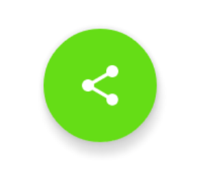

# Project 5: Make Your App Material

An Android app mocked up as RSS feed reader featuring banner photos and shocking headlines! This project is designed to practice improving an app design, the important skill in making your app stand out and succeed. It also replicates a common developer task of updating and changing an app's design as new standards are released. In this project, given a set of user feedbacks, the XYZ Reader app is redesigned to follow the Material Design guidelines and translate a set of static design mocks to a living and breathing app.

## Starting Code

The existing app has serious design issues. The Body text color are choosen badly giving very low constrast to the white background, which make it hard to read. Images are not properly scaled and the theme colors used throughout the app make it looks so gloomy. The floating action button (FAB) doesn't look like it is really floating compared to typical FABs.

 

**User Feedback for XYZ Reader:**

* Lyla says: "This app is starting to shape up but it feels a bit off in quite a few places. I can't put finger on it but it feels odd."
* Jay says: "Is the text supposed to be so wonky and unreadable? It is not accessible to those of us without perfect vision."
* Kagure says: "The color scheme is really sad and I shouldn't feel sad."
* See [project description](https://github.com/udacity/Project-Descriptions-for-Review/blob/master/Android/Make%20Your%20App%20Material.md) for more detail.

**[Download APK and Try it](./readme/XYZReader-prod.apk)**, and compare with the [XYZ Reader before redesigned](./readme/XYZReader-beta.apk)
  

## The redesigned app
Following the Material Design guidelines the app now looks delightful and easier to read.

**Phone screenshots**

  

**Tablet screenshots**

 

### New theme colors
Based on the orange color in the existing app icon, deep orange 500 and 700 are selected as the app theme primary and dark primary color, respectively. The accented light green A700 is then selected as the app theme accent color because it being complementary colors.

 

### Immersive experience
With the images are properly scaled using scale type of center crop, the app now looks much more attrative. To give an immersive experience in detail screen the banner image take majority of the screen real estate with transparent overlay as a scrim to make text readable.

  

### Floating Action Button (FAB)
The existing Floating Action Button (FAB) was created from ImageButton with 2dp elevation. Following the material design guidelines, now it is created with Android Design Support Library's FAB widget with standard elevation of 6dp.

 

### Collapsing Toolbar
With Design Support Library, lively animated UI of an image collapsed into a toolbar can be created with simple configuration in XML.

**Skill required:** _Material Design, Styles and Themes, FAB, CoordinatorLayout, AppBarLayout, NestedScrollView, CollapsingToolbarLayout_

**Remark:** This application is Ratanachai's work for Udacity [Android Developer Nanodegree program](https://www.udacity.com/course/android-developer-nanodegree-by-google--nd801)
